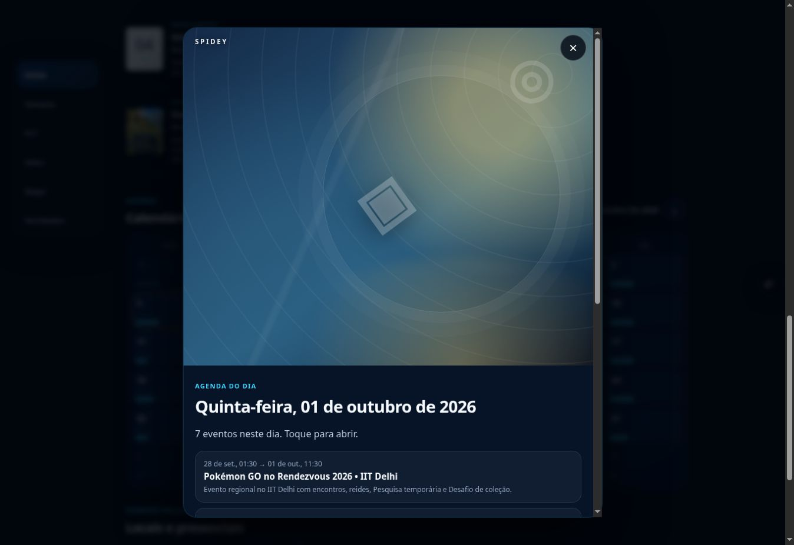
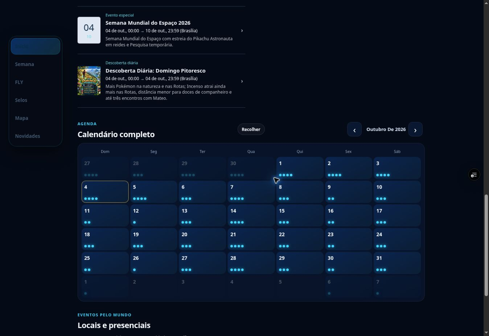

# Calendário de Brasília e agenda — 04/10/2026

**PASSED_PREVIEW** no código `d3d26e100a060b26b4731dc6aea2046b18e41662`, branch `spidey-fly-v1`. Android físico, acesso durável para testadores, push e lançamento completo permanecem pendentes.

Preview: https://spidey-pokemon-n6qdbrhqj-spidey3.vercel.app/spidey-app/index.html. Deployment `dpl_6TegdHKSHaAY5UAnuvaENWb8Fp5E` READY, target null. A URL sem o parâmetro de compartilhamento exige login. Token efêmero não registrado neste documento.

## Correções

A agenda calculava os dias no fuso do aparelho enquanto mostrava os horários de Brasília. Em Los Angeles, eventos com início em 02/10 apareciam na agenda de 01/10. As comparações agora usam as datas de Brasília; Hoje e viradas de mês/ano seguem a mesma regra. O modo de início único e os eventos ocultos mantêm seus critérios anteriores.

A agenda diária também recebia a capa do primeiro evento, empurrando a lista para baixo. Ela agora exibe a lista diretamente, com fechamento acessível e scroll inicial zero. As artes próprias continuam no detalhe dos eventos. Detalhes sem local mostram “Horários”, sem anunciar uma confirmação geográfica inexistente.

Arquivos de implementação: `app.js`, `calendar-enhancements.js`, `experience-v1.js`, `qa-corrections-v1.js`, `art-coverage-v1.js`, `app-v2-4.js`, `player-ui.css`, versões em `index.html`/`sw.js`. Dois arquivos de teste acrescentam quatro regressões reais.

## Validação

37 testes Node passaram, além de sintaxe e diff check. As regressões executaram UTC, Brasília, Taipei e Los Angeles, cobrindo o catálogo real em 01/10–02/10, meia-noite, início único, eventos ocultos, agenda sem capa e viradas de mês/ano.

| Dia de Brasília | Eventos observados no navegador |
| --- | --- |
| 01/10 | Delhi, Applin, Quinta de Batalhas GO, Seedot |
| 02/10 | Applin, Invasão, Indonésia, Sexta da Amizade |

Mobile Claro 390×850 e desktop Escuro confirmaram os quatro eventos de 01/10, sem overflow horizontal; foco no botão Fechar e scroll inicial zero. A agenda de 02/10 confirmou os quatro eventos; inspeção direta contou zero `.spidey-cover-art` e zero imagens na agenda. O detalhe da Sexta da Amizade abriu o PNG aprovado completo 1122×1402, exibiu “Horários” e não mostrou o antigo local pendente.

O teste HTTP de compartilhamento começou com CookieJar vazia e sem credenciais. Com o novo link temporário: HTML, catálogo e PNG retornaram 200; o PNG servido foi idêntico ao master, SHA256 `2254345286060be310fbee286d00c78ce317da26feec3c6767469d6bceedb31f`. A URL sem token, em outra sessão vazia, redirecionou para `/login` do Vercel. O endpoint push retornou 503 `push_not_configured`.

**Abertura pelos testadores no celular: não revalidada.** A prova HTTP não certifica que o bloqueio relatado em 03/10 foi resolvido. A proteção do projeto permanece ativa; não houve novo login administrativo ou envio de alertas.

Catálogo e master inalterados. Comparação de árvore confirmou todos os 301 arquivos de artes, catálogo, master, workflows, filas e notificações protegidos iguais ao checkpoint `e766dde`. O checkpoint `de88306` preservou o lote anterior de sete artes e suas 14 capturas. Janela 01–07/10: 23 eventos, 20 APPROVED, 0 candidatas e 3 recusas preservadas.

## Provas e continuidade

JSON principal: `CALENDAR_BRASIL_20261004.json`. Observações: `calendar-browser-d3d26e1-20261004.json`. HTTP: `calendar-share-anonymous-d3d26e1-20261004.json`. Hashes e tamanhos constam do JSON principal.

Continuar com comprovação no celular e acesso durável, configuração/recebimento de push e QA físico Android/PWA/instalação/atualização/offline. Applin, Espaço e Sizzlipede continuam com recusas documentadas, sem contorno. Produção não aprovada; nenhuma promoção para main, dispatch ou mensagem externa. Retomar do HEAD remoto corrente, preservando este código validado.
