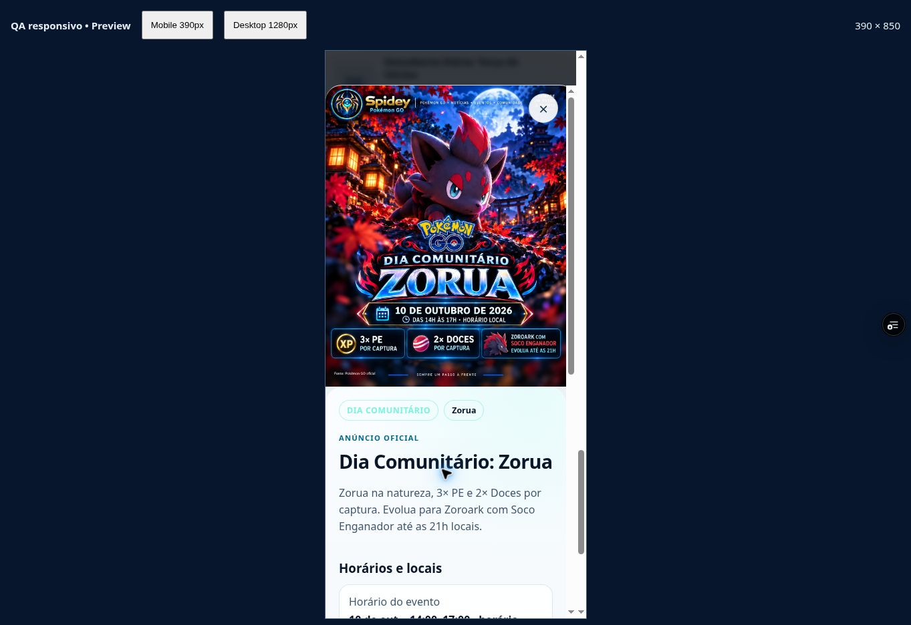
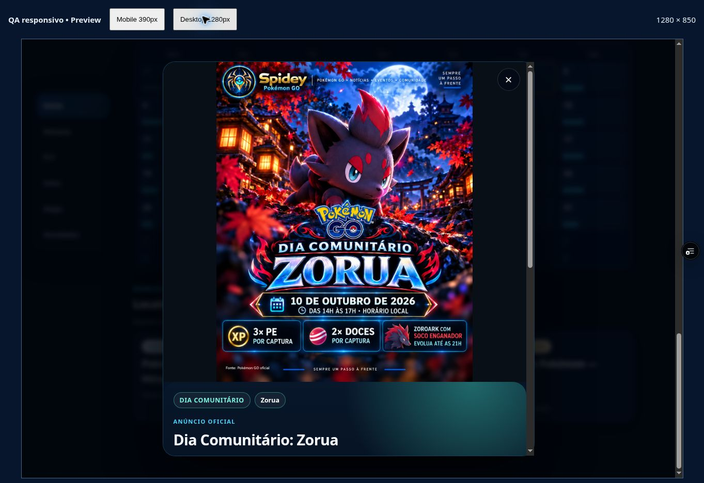
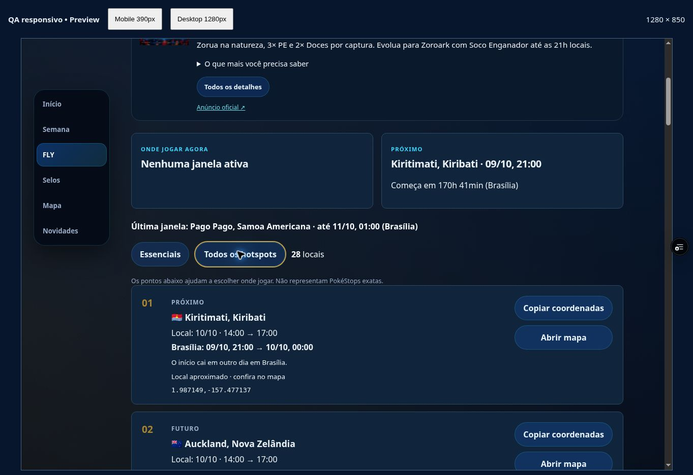

# GPX, alertas e Zorua — QA de 02/10/2026

Código: `a2b56386e2eed9ba5cd173c7fb3590e8aa122f88`, branch `spidey-fly-v1`. Preview READY: https://spidey-pokemon-cg9922frj-spidey3.vercel.app/spidey-app/index.html.

Zorua conferido em detalhe mobile 390 Claro/desktop 1280 Escuro, pôster inteiro 1121×1403, sem overflow horizontal, origem candidata correta, marca/fonte visíveis. A ação Ver rota mundial fecha o diálogo e conserva eventId/PNG; 20 essenciais, 28 completos. Conversões Brasília conferidas com IANA: Kiritimati 09/10 21h→10/10 00h, Taipei 10/10 03–06h, Pago Pago 10/10 22h→11/10 01h. Aprovação humana continua pendente.

Push: rota implantada respondeu 503 push_not_configured, no-store. Clique real exibiu indisponibilidade e reabilitou o botão. Nenhuma ativação/recebimento real comprovado, nenhuma configuração/inscrição/envio alterado.

GPX: link nativo para Japão 17/17 confirmado; rota incompleta 0/5 sem link. Duas capturas de download expiraram sem caminho/arquivo. GPXs antigos não contam como prova do novo deploy. Captura da imagem também expirou. Download/XML continua pendente.

31 testes Node e sintaxe de 25 scripts ativos/JSON passaram nesta rodada, além de diff check. Offline/update foi simulado nos testes do worker; não é prova de Android físico. Home/Semana atual não contêm Zorua de 10/10. Os bytes servidos da nova imagem não foram capturados; o hash do PNG local/versionado está no manifesto.

Sizzlipede recusado pela ferramenta, sem arquivo; prompts e request ID no manifesto Zorua. Applin/Espaço continuam sem peça nova. Master/originais/124 IDs preservados. Nenhuma promoção a main/produção.

Observações completas: [JSON do relatório](DOWNLOAD_PUSH_ZORUA_QA_20261002.json), [DOM](spidey-browser-a2b5638-20261002.json), [manifesto](ZORUA_REVIEW_20261002.json).
