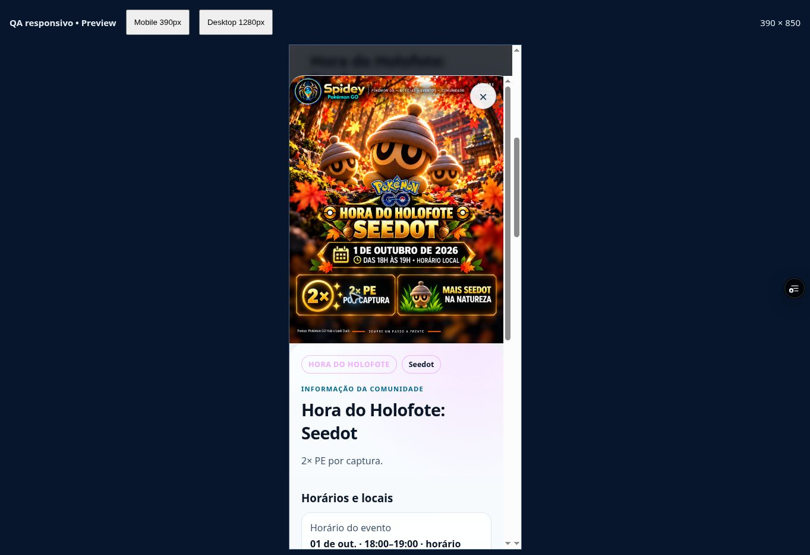
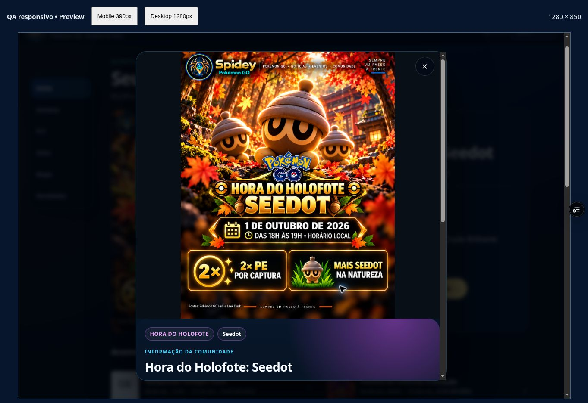

# Seedot — próxima arte disponível, 01/10/2026

Base `aaaedd1`, branch `spidey-fly-v1`, continuidade sem reinício. Pôster corrigido de Seedot **PENDING_REVIEW**, PNG 1121×1403, SHA256 `6ac0ebbd5b6032f731efd3edbd4209443b7df6ba7e9c1ed098485feefa2d882f`. 01/10, 18–19h locais, 2× PE por captura e mais Seedot na natureza; removidas alegações incorretas do antigo Community Day. [Manifesto de arquivo/fatos/fontes/prompts/recusas](NEXT_ART_REVIEW_20261001.json).

Fontes da comunidade verificadas: [Pokémon GO Hub](https://pokemongohub.net/post/event/seedot-spotlight-hour-october-2026-last-minute-guide/) e [Leek Duck](https://leekduck.com/events/pokemonspotlighthour2026-10-01/). Fonte oficial de [Semana Mundial do Espaço](https://pokemongo.com/pt-BR/news/world-space-week-2026): 04–10/10, reides de uma estrela e pesquisa gratuita com resgate até 12/10 23h59 local. Fonte oficial de [Applin](https://pokemongo.com/pt-BR/news/harvest-festival-2026) reconsultada; dados anteriores mantidos.

Applin repetido com o mesmo pedido foi recusado novamente, sem arquivo. Primeira geração de Espaço também recusada, sem arquivo. Nenhuma substituição vetorial é promovida a Premium. Master aprovado/candidatas anteriores e originais byte a byte preservados. Inventário 23 eventos: 3 APPROVED, 1 pôster PENDING_REVIEW, 19 sem arquivo Home/FLY.

Testes locais: **15 Node passaram**; sintaxe dos 18 scripts ativos/SW, JSON, precache, hashes e `git diff --check` passaram. Apenas os registros de Seedot e Espaço mudaram no catálogo; master e registros de aprovação anteriores inalterados. QA em preview concluído abaixo; decisão humana sobre o Seedot exato permanece pendente. Aprovação de Xerneas/Invasão/Cinderace preservada; esta candidata não a herda. Android/PWA/push e demais coberturas ainda pendentes; sem produção.

## QA do código 2ed7ef8 — 01/10/2026

Deploy READY `dpl_AV7yjHyCzHJkfBVUFzDgaEMw6hio`, código `2ed7ef81b43d728e421e12e4888543d5155a5510`. Preview seguro aberto/verificado: https://spidey-pokemon-1v45kgmxg-spidey3.vercel.app/spidey-app/index.html. QA responsivo: https://spidey-pokemon-1v45kgmxg-spidey3.vercel.app/spidey-app/qa-responsive.html. O checkpoint documental posterior não altera o código conferido.

- Home mobile carrega o PNG exato, natural 1121×1403, `complete=true`, query `6ac0ebbd5b60`, pôster integral e informação da comunidade.
- Detalhe em mobile 390×850 Claro e desktop 1280×850 Escuro: imagem inteira, Fechar acessível, scroll inicial zero, uma ação Ver rota mundial. Medidas sem overflow horizontal: 375/375 e 1265/1265; app direto 1348/1348.
- Semana resolve a mesma candidata, imagem completa. Enter abriu o detalhe no iframe mobile; clique no título abriu no app direto desktop. O clique automatizado no card do iframe mobile deixou diálogo fechado; não declarar toque físico aprovado nem presumir correção de código por esse comportamento da automação.
- FLY abriu em Seedot e fechou o modal; imagem/horário/bônus/fonte preservados no mobile. Essenciais 20 / Todos 28; Taipei local 01/10 18–19h → Brasília 07–08h; Pago Pago → 02/10 02–03h Brasília. Coordenadas permanecem referências aproximadas.
- App direto confirmou Xerneas/Invasão/Cinderace completos 1121×1403, caminhos premium e hashes anteriores. Nenhum master foi alterado.
- Detalhe de Espaço mostrou evento 04–10/10, pesquisa gratuita, reides de uma estrela e resgate até 12/10 23h59 local; fonte oficial. Visual técnico permanece sem aprovação Premium.
- Log recente consultado mostrou erros da extensão; nenhum erro do app observado nessa amostra, sem alegação de ausência global de erros.

Provas do mesmo byte capturado e inspecionado:

Hashes dos prints no manifesto JSON. **PENDING_REVIEW** permanece: a aprovação humana deve ser vinculada exclusivamente ao PNG `6ac0ebbd5b6032f731efd3edbd4209443b7df6ba7e9c1ed098485feefa2d882f`. Não herda as decisões de Xerneas/Invasão/Cinderace. Sem aprovação de lançamento. Android físico/instalação/upgrade/offline PWA/push e clipboard/GPX real continuam sem prova. Applin/Espaço sem imagens por recusa documentada; cobertura restante pendente.
