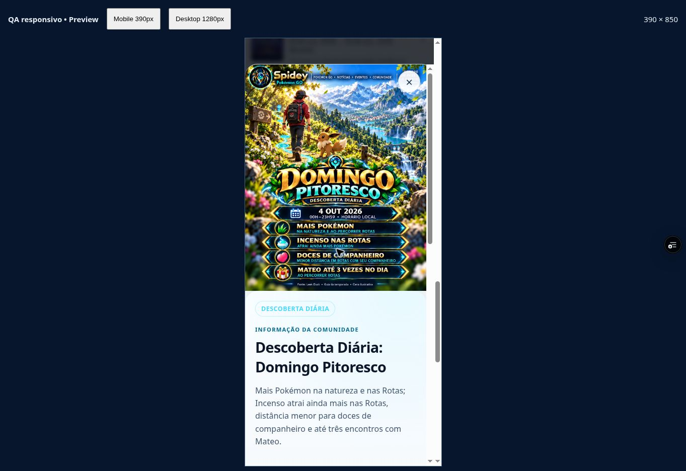
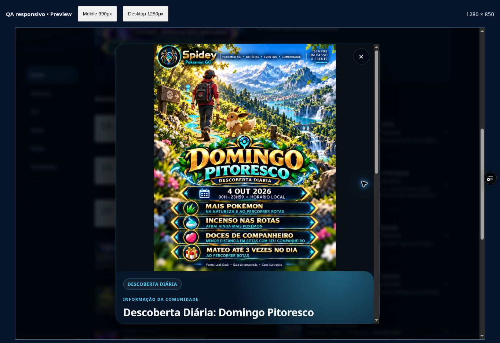

# Domingo Pitoresco — aprovação de 03/10/2026

Domingo Pitoresco de 4/10 APPROVED pela decisão “Aprovo” de 03/10, 16:52:31 BRT. Cópia premium idêntica à candidata v2, sem regeneração. QA PASSED_PREVIEW no código `bfeeb24`: 33 testes, mobile Claro 390×850/desktop Escuro 1280×850 e PNG servido exato. Master com 17 entradas; 16 anteriores/15 arquivos preservados. Janela 01–07/10: 23 eventos, 12 APPROVED, nenhuma candidata ativa e 11 sem arte Home/FLY. Acesso público BLOCKED_USER_PHONE_LOGIN; Android/PWA/push pendentes. Registro: `docs/qa/SCENIC_SUNDAY_APPROVAL_20261003.json`.

- Decisão: “Aprovo”, 03/10 16:52:31 BRT.
- EventId: `2026-10-04-scenic-sunday`.
- Candidata: `spidey-app/assets/events/review/scenic-sunday-20261004-v2.png`, revisão2.
- Aprovada: `spidey-app/assets/events/premium/scenic-sunday-20261004-approved-v1.png`, revisão aprovada1, byte a byte igual.
- PNG:1122 ×1402,2.739.274bytes; SHA256 `0ecff3534586f2387869aaf343298dab7377c421c598e5591f2e27133f6ba977`.
- Revisão histórica congelada: `docs/qa/SCENIC_SUNDAY_REVIEW_20261003.json`, SHA256 `aff543fb8f435ffb6602efcfe4892e4a137c3d5f91b9eab50e3232ab4f3f0efd`.

## Validação

33/33 testes Node; sintaxe master/preview/SW; 16 masters/15 arquivos prévios intactos, helper inteiro igual, nenhum candidato ativo, catálogo124 inalterado, cache77 arquivos, cinco papéis resolvem o master. Auditoria `docs/qa/scenic-sunday-approved-local-audit-20261003.json`. Preview novo READY `dpl_Ds5ovzfof7tmatsTw3KEGPG2TChf` do código `bfeeb24797b582441cd8e217f37bac4e485ae356`; conferência `docs/qa/scenic-sunday-approved-browser-bfeeb24-20261003.json`. Mobile390×850Claro/desktop1280×850Escuro: PNG inteiro/contain, focoFechar, scrollTop0 e sem overflow horizontal. Arquivo servido2.739.274bytes/hash acima, idêntico ao aprovado.

SHA256 `c61cf225b83aa9c2d565aa3c097138663650be4f0250e8a617850bd545434328`; 117268bytes.

SHA256 `3c297b81945278db2f3b9303e16978337e694d5b27ddd8e8e76b82adf1ccdadf`; 164395bytes.

## Limites e continuidade

Fonte atual comunitária e condições de Rotas/companheiro mantidas; Eevee ilustrativo. Catálogo/fatos/horários/FLY/GPX/push inalterados. Nenhuma nova elegibilidade FLY. Semana sem nova prova visual de miniatura (somente resolver local validado); placeholder genérico de local continua. Acesso público para terceiros BLOCKED_USER_PHONE_LOGIN; cookie temporário somente para QA. Android/PWA/push físicos pendentes, sem aprovação de lançamento/main/produção. Próximas11artes e acesso/Android são pendências separadas.
