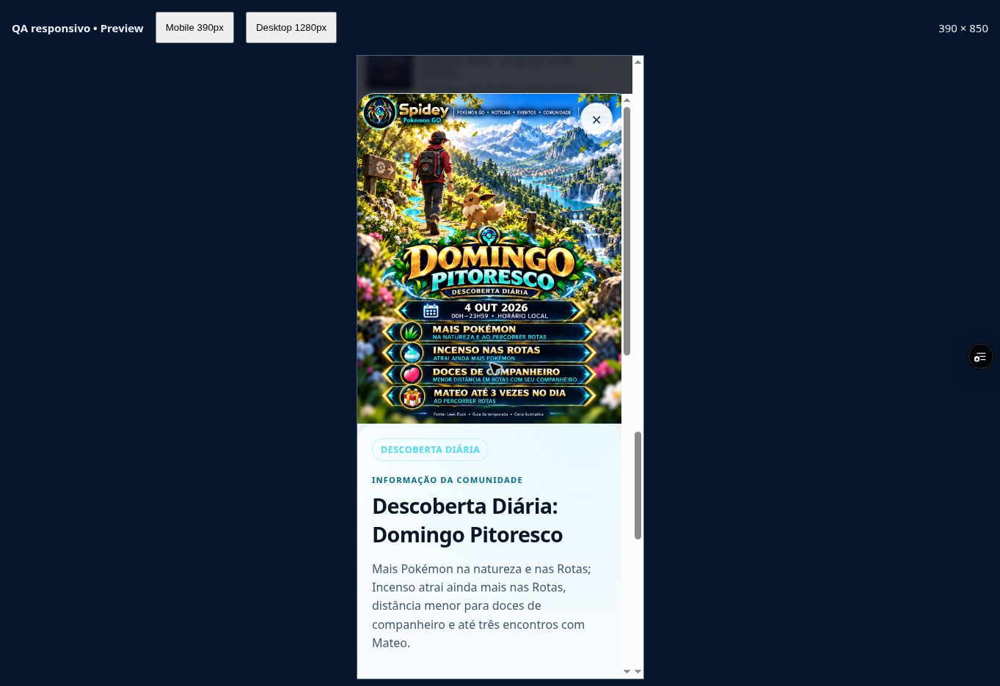
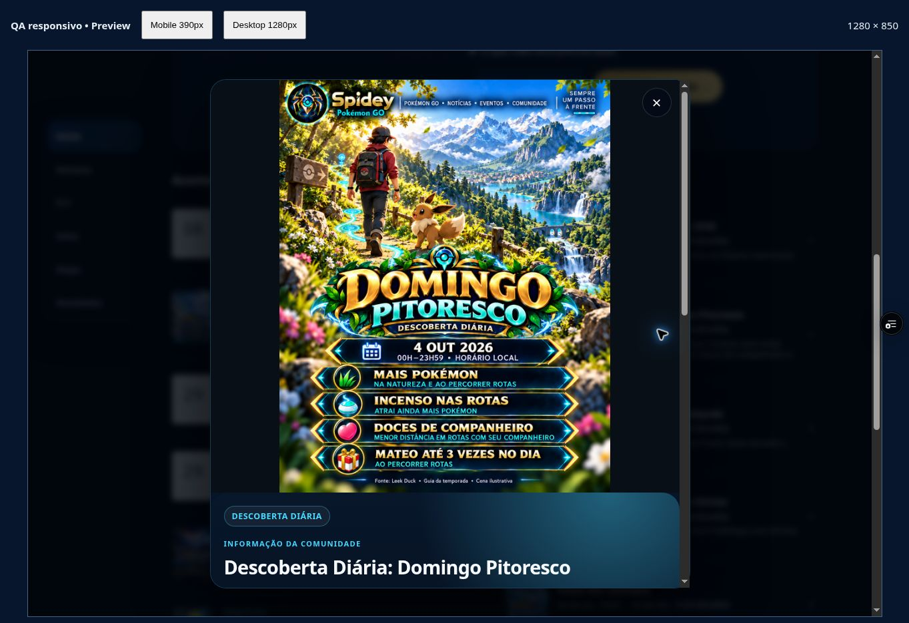

# Domingo Pitoresco de 4/10 — candidata v2 para aprovação

Domingo Pitoresco de 4/10: candidata v2 PENDING_REVIEW, revisão humana ainda pendente. QA PASSED_PREVIEW no código `14fa3ad`: 33 testes, mobile Claro 390×850/desktop Escuro 1280×850 e PNG servido idêntico à candidata. 16 masters aprovados/15 arquivos preservados. Janela 01–07/10: 23 eventos, 11 APPROVED, 1 candidata e 11 sem arquivo Home/FLY. Fonte atual Leek Duck identificada como comunidade; bônus condicionados a Rotas/companheiro. Acesso público BLOCKED_USER_PHONE_LOGIN e Android/PWA/push pendentes. Registro: `docs/qa/SCENIC_SUNDAY_REVIEW_20261003.json`.

Domingo Pitoresco de 4/10: candidata v2 PENDING_REVIEW, revisão humana ainda pendente. QA PASSED_PREVIEW no código `14fa3ad`: 33 testes, mobile Claro 390×850/desktop Escuro 1280×850 e PNG servido idêntico à candidata. 16 masters aprovados/15 arquivos preservados. Janela 01–07/10: 23 eventos, 11 APPROVED, 1 candidata e 11 sem arquivo Home/FLY. Fonte atual Leek Duck identificada como comunidade; bônus condicionados a Rotas/companheiro. Acesso público BLOCKED_USER_PHONE_LOGIN e Android/PWA/push pendentes. Registro: `docs/qa/SCENIC_SUNDAY_REVIEW_20261003.json`.

PNG integral `assets/events/review/scenic-sunday-20261004-v2.png`, 1122 × 1402, 2739274 bytes, SHA256 `0ecff3534586f2387869aaf343298dab7377c421c598e5591f2e27133f6ba977`. V1 preservada para histórico; ícone de rosto não validado substituído por presente via imagegen na v2. Eevee é ilustrativo, sem promessa de encontro destacado. A vigência nesta temporada vem do guia comunitário; anúncio oficial de junho confirma a mecânica da temporada anterior e não prova outubro isoladamente. Fonte/datas/bônus/observações enriquecidos somente para `2026-10-04-scenic-sunday`; outros 123 eventos e horários/calendário/coordenadas/GPX preservados.

Integração explícita PENDING_REVIEW/full_poster, resolver comum nos cinco papéis, sem inclusão no master ou concessão de `spidey-premium-v1`. Helper inteiro preservado; cache 77 paths e query de preview versionados. Home e detalhe renderizam a mesma candidata; Semana mostra o evento em linha textual de 4/10, sem miniatura de pôster observada. Não cria nova elegibilidade FLY. Provas e limites: `docs/qa/scenic-sunday-browser-14fa3ad-20261003.json`, auditoria `docs/qa/scenic-sunday-local-audit-20261003.json`. Sem promoção a main/produção ou alteração de proteção/push. Próximo: entregar PNG completo para decisão humana específica; depois artes restantes e frentes públicas/físicas pendentes.

Prévia conferida: https://spidey-pokemon-e2uhsymr1-spidey3.vercel.app/spidey-app/index.html (acesso da própria conferência; não constitui link público confirmado para terceiros).

