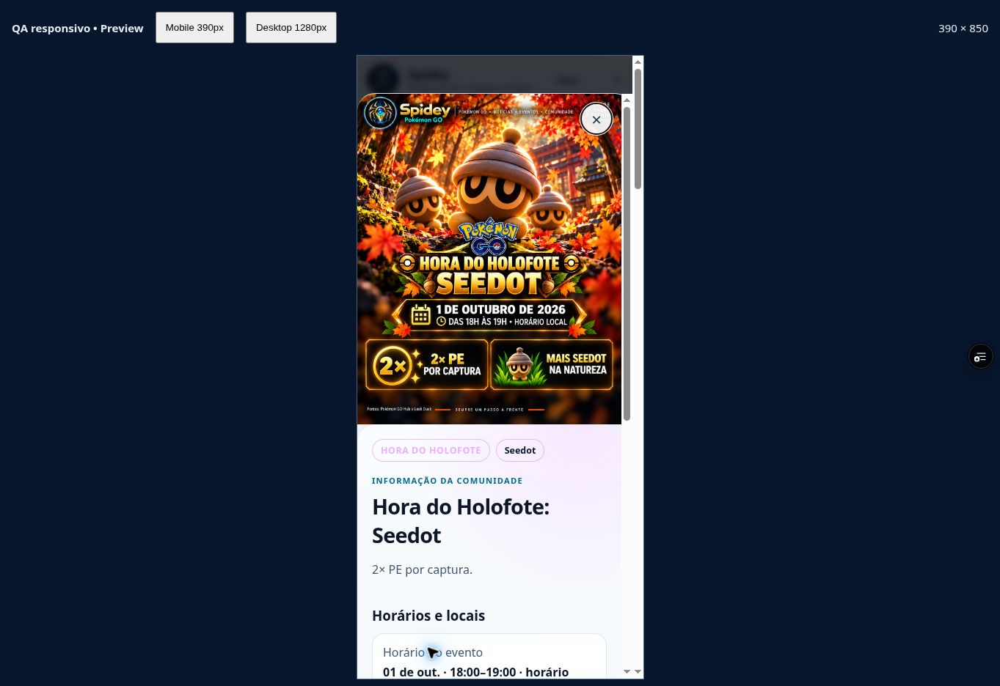
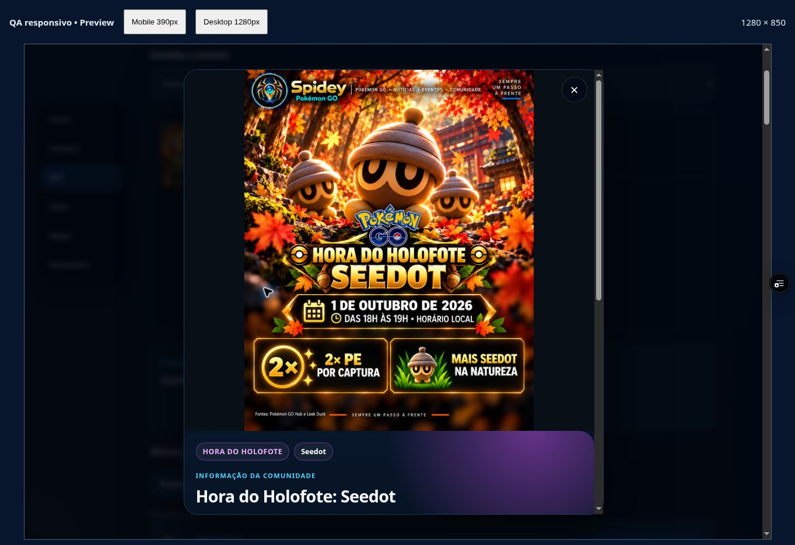

# Seedot — aprovação humana e integração, 01/10/2026

Decisão explícita “Sim, aprovo” em 01/10 às 19:07:44 BRT, após o print e preview do checkpoint `8d5541e`, código revisado `2ed7ef8`. Somente `2026-10-01-spotlight-seedot`. [Registro exato de decisão/bytes/eventId/fatos/prova](SEEDOT_APPROVAL_20261001.json). Histórico de edição/prompts/recusas e QA anterior em [NEXT_ART_REVIEW_20261001.json](NEXT_ART_REVIEW_20261001.json) e [NEXT_ART_20261001.md](NEXT_ART_20261001.md), preservados.

PNG aprovado `spidey-app/assets/events/premium/seedot-spotlight-approved-v1.png`, SHA256 `6ac0ebbd5b6032f731efd3edbd4209443b7df6ba7e9c1ed098485feefa2d882f`, 1121×1403, 2.215.863 bytes, cópia idêntica à candidata. Master é autoridade única, full_poster/dimensões preservadas. Somente Seedot sai do preview; Zorua permanece pendente. Fonte de Seedot permanece comunidade. Não regenerar nem alterar PNG.

Shell `2026-10-01-seedot-approved-v1`, cache homônimo; novo path premium no precache, query de hash mantida. Todos os masters anteriores e os registros históricos intactos. Inventário 01–07/10: 23 eventos, 4 APPROVED e 19 sem arquivo Home/FLY. Applin/Espaço bloqueados por recusa, demais coberturas e Android/PWA/push pendentes. Nenhuma promoção a main/produção.

16 testes Node passaram; sintaxe dos 18 scripts ativos/SW, JSON/precache/hashes e diff passaram. Confirmação dos paths premium concluída abaixo. QA anterior da candidata permanece histórico separado.

## Confirmação pós-aprovação — b310f5a

Código `b310f5aefba0e3f6b841f8014e8b0677442922ef`, deploy READY `dpl_DFyY8YzAB9BUmUa1n7L2u22BZQCx`. App direto aberto/verificado: https://spidey-pokemon-5uir2c532-spidey3.vercel.app/spidey-app/index.html. O checkpoint documental posterior não altera código nem dados conferidos.

- Semana e detalhe usam `assets/events/premium/seedot-spotlight-approved-v1.png?v=6ac0ebbd5b60`, `complete=true`, natural 1121×1403.
- Mobile 390×850 Claro e desktop 1280×850 Escuro: pôster inteiro, Fechar acessível, detalhe no topo, sem overflow horizontal medido (375/375 e 1265/1265).
- Ação única Ver rota mundial fecha modal e mantém Seedot selecionado. FLY usa path aprovado, mostra 20/28 locais, Taipei 01/10 07–08h e Pago Pago 02/10 02–03h Brasília.
- Abertura da Semana observada por Enter no iframe mobile e clique no título no app direto desktop. Toque Android físico continua sem prova.
- Após 19h em Brasília, destaque da Home passou a Xerneas; Seedot não foi forçado à janela local encerrada. Home confirmou os masters Xerneas/Invasão/Cinderace completos 1121×1403 em paths/hashes anteriores. A aprovação Seedot está preservada para Semana/FLY/detalhe.
- 16 testes Node e sintaxe dos 18 scripts/SW/JSON/precache/hashes/diff passaram. Precache local tem 63 arquivos, 16.269.934 bytes em disco; isso não mede tráfego nem comprova instalação/offline.

Hashes dos prints registrados no JSON. Aprovação desta arte não aprova lançamento; 19 coberturas e Android/PWA/push/clipboard/GPX real continuam pendentes. Próxima frente preparada: [brief factual de Mega Victreebel](MEGA_VICTREEBEL_BRIEF_20261001.json); [roteiro do QA Android](PUBLIC_ANDROID_QA_20261001.md). Nenhuma nova tentativa de Applin/Espaço e nenhum contorno das recusas nesta rodada.
