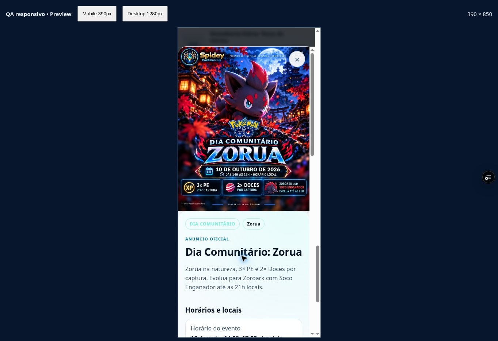
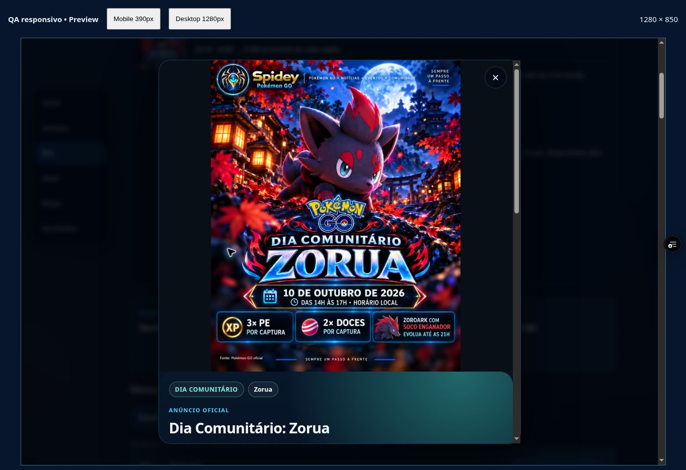
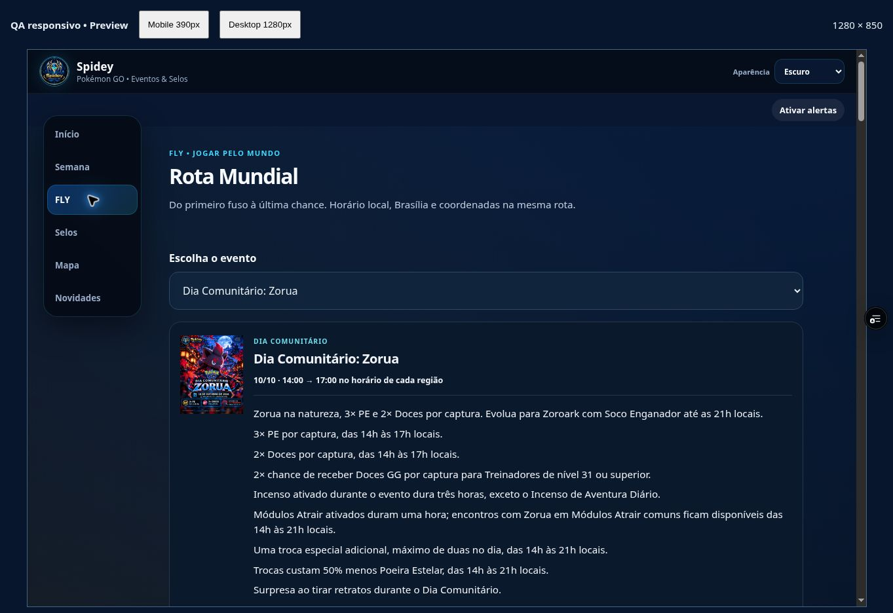

# Zorua aprovado — verificação de 02/10/2026

**APPROVED / PASSED_PREVIEW.** Aprovação explícita de Anderson às 18:38:35 BRT preservada. Retomada às 20:49:18 BRT: “Opa / Voltei, temos sinal”. Código `0433c322c43839f13a36996d52e511475c8739ae`; deploy `dpl_8EsSkfWnfXqbB9rLNPTHUfXfEJpB`. [Preview conferido](https://spidey-pokemon-bwb814dm8-spidey3.vercel.app/spidey-app/index.html). Registro UTC 2026-10-03T00:03:06.669Z (02/10 em Brasília).

Calendário → 10/10 → detalhe conferido no app direto. Mobile responsivo 390×850 Claro e desktop 1280×850 Escuro: pôster completo, object-fit contain, foco Fechar, scrollTop 0 e sem overflow horizontal nas medidas. O PNG servido foi baixado: 1121×1403, 2.299.199 bytes, SHA256 `9bdb113f3e0c2c6d837797b6ee951778f9605c2ba38d74967837885ebe72778b`, idêntico ao arquivo aprovado. Nenhuma regeneração; candidata/original e 11 entradas anteriores preservados.

Bônus presentes no detalhe e FLY e rechecados no [anúncio oficial](https://pokemongo.com/pt-BR/news/communityday-october-2026-zorua): 10/10, 14–17h locais, 3× PE e 2× Doces por captura; Doces GG nível 31+, Incenso, Módulos Atrair, trocas e retratos. Prazo de evolução para Soco Enganador: 21h, calculado de 17h + quatro horas oficialmente informadas.

FLY usa o mesmo eventId `2026-10-zorua-community-day` e PNG aprovado, fecha o diálogo e oferece 20 essenciais/28 hotspots, coordenadas e horários local/Brasília.

| Referência | Horário local | Brasília |
| --- | --- | --- |
| Kiritimati | 10/10, 14–17h | 09/10, 21h → 10/10, 00h |
| Taipei | 10/10, 14–17h | 10/10, 03–06h |
| Pago Pago | 10/10, 14–17h | 10/10, 22h → 11/10, 01h |

**GPX Japão: PASSED_DOWNLOADED_XML.** Clique no link nativo criou arquivo novo às 23:58:30.916905Z. A espera do evento do navegador expirou; arquivo real foi capturado pela pasta compartilhada. Os três downloads antigos não foram usados como prova desta rodada. XML GPX 1.1, 17 waypoints; todos os nomes, latitudes, longitudes e ordem correspondem ao catálogo deste commit. 1.890 bytes, SHA256 `8870435145133c11894b923dad8dead2bff056e78a7c79104346fb1e7e12382a`. Coordenadas comunitárias exatas não são declaradas oficiais. PokéXciting 0/5 continua sem link GPX completo.

Provas estruturadas: [DOM e hash servido](zorua-approved-browser-0433c32-20261002.json), [verificação GPX](japan-rally-browser-download-0433c32-20261002.json), [GPX capturado](japan-rally-browser-download-0433c32-20261002.gpx), [registro da aprovação](ZORUA_APPROVAL_20261002.json).

Provas adicionais: [FLY mobile](spidey-zorua-fly-mobile-0433c32-20261002.jpg), [link de GPX](spidey-japan-gpx-link-0433c32-20261002.jpg).

Limites: iframe não comprova Android físico/instalação/atualização/offline/recebimento push. Novo endpoint public-key respondeu HTTP 503 `push_not_configured`, no-store; configuração incompleta. Home seis próximos/Semana 28/09–04/10 não incluem Zorua, sem prova visual nova dessas superfícies. Último inventário 01–07/10: 23 eventos, 8 APPROVED e 15 sem arquivo Home/FLY; Zorua fora dessa janela. Recusas Applin/Espaço/Sizzlipede preservadas. Os 31 testes/sintaxe são resultados válidos da consolidação anterior, sem nova execução nesta rodada documental. Lote de logs contém erros da extensão de metadados; não atribuídos ao app. Lançamento público/produção continuam pendentes; nenhuma promoção a main, configuração secreta, inscrição/envio push ou mensagem externa nesta rodada.
